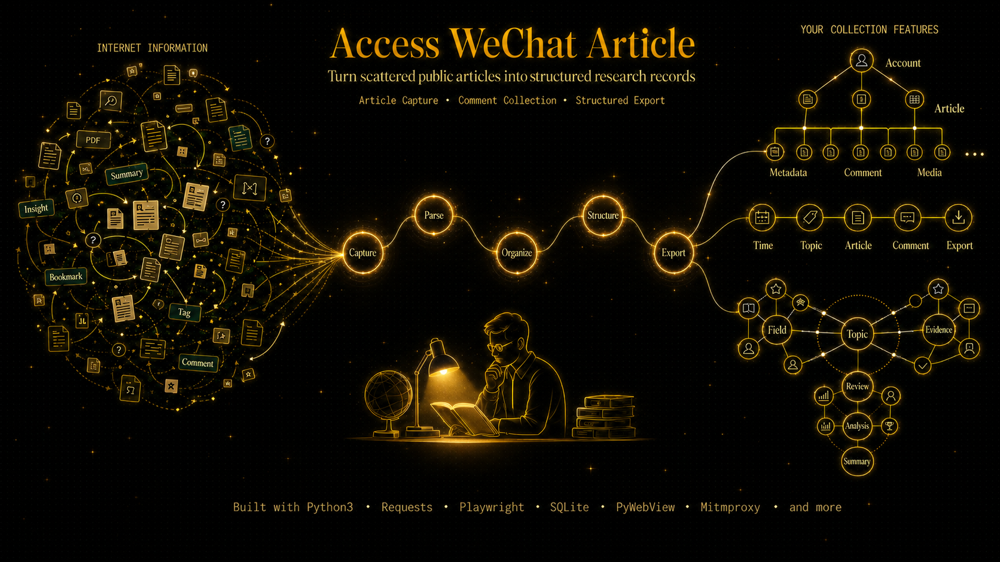
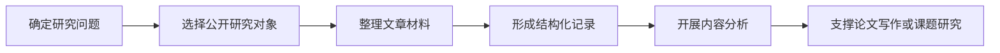

<h1 align="center">Access WeChat Article</h1>

  <strong>面向学术研究与公开文章材料整理的科研辅助工具</strong>

  
  
  
  
  

  

Access WeChat Article 是一个面向学术科研场景的公开文章研究辅助项目，主要用于帮助研究者围绕微信公众号公开文章进行材料整理、字段记录、任务管理和后续分析准备。

它的目标不是替代研究判断，也不是提供面向商业化或大规模自动化用途的工具链，而是为传播学、社会科学、公共议题研究、内容分析和数据整理工作提供一个更清晰、可复核、可持续维护的本地研究工作台。

>  📌**注意事项**
>
>  本项目为科研辅助工具，**仅限学术研究、个人学习和非商业用途**使用。
>
>  项目本身不提供、不存储、不传播任何受著作权保护的内容，也不鼓励任何规避平台规则或侵犯他人权益的使用方式。
>
>  使用者必须遵守微信平台服务协议、《网络安全法》及相关法律法规，不得用于侵犯他人著作权、隐私权、商业竞争或其他非法目的。
>
>  任何违反法律法规、平台规则或研究伦理的使用行为均与本项目无关，使用者应自行承担全部责任。

---

## 项目定位

在公众号公开文章相关研究中，研究者常常需要面对大量材料：文章标题、发布时间、账号信息、主题线索、互动指标、任务状态和后续分析字段分散在不同位置，手工整理成本高，也容易缺少一致的记录标准。

Access WeChat Article 希望解决的是这个问题：把公开文章研究材料整理成更稳定的结构，帮助研究者把注意力放回研究问题本身。

它更适合被理解为一个“研究材料管理工作台”，而不是一个单纯的技术脚本。

---

## 核心能力

| 能力 | 说明 |
| --- | --- |
| 研究材料整理 | 围绕微信公众号公开文章建立清晰的材料记录入口，减少零散手工整理成本 |
| 字段结构化 | 将标题、账号、发布时间、研究类型、任务状态等字段整理为后续分析更容易使用的形式 |
| 任务状态管理 | 帮助研究者区分已处理、待处理、异常或需要复核的研究材料 |
| 研究过程辅助 | 为内容分析、传播研究、议题追踪和数据清洗提供前置材料支持 |
| 桌面化交互 | 通过本地应用界面组织任务、配置、进度和记录，降低纯命令行使用门槛 |

---

## 适合的学术场景

- 传播学研究中，对特定公众号、议题或时间段的公开文章进行材料整理。
- 社会科学研究中，对公共议题、机构传播、媒体表达和受众互动线索进行初步记录。
- 内容分析研究中，为编码表、主题标注、文本清洗和后续统计分析准备基础材料。
- 舆情与公共传播研究中，对公开文章的发布时间、内容主题和传播表现进行阶段性观察。
- 课程论文、毕业论文、课题项目中，需要建立可复核的公开材料整理流程。

---

## 研究工作流

  

> 图片占位提示词：生成一张 16:9 横向科研工作流示意图。主题是“公开文章研究流程”。从左到右依次展示：确定研究问题、选择研究对象、整理文章材料、形成结构化记录、开展内容分析、支撑论文写作。每个节点使用简洁学术风格图标，例如问号、资料夹、表格、标签、图表、论文页面。画面不要出现异常网络操作、攻击、服务器入侵等视觉暗示。整体风格清爽、学术、可信，适合 README 中展示项目用途。

---

## 功能概览

### 研究字段记录

项目围绕公开文章研究常用字段组织信息，例如账号名称、文章标题、发布时间、文章链接、研究类型、处理状态和时间记录等。字段设计服务于后续检索、筛选和统计，而不是追求复杂的数据展示。

### 任务与进度管理

研究材料整理往往不是一次完成的工作。项目通过任务状态、运行记录和历史视图，帮助研究者持续跟踪研究材料处理进度，减少重复劳动和遗漏。

### 桌面端研究工作台

项目采用本地桌面应用形态，尽量把研究任务配置、材料列表、运行状态和基础记录集中在一个界面中。对于不希望长期操作命令行的研究者，这种方式更直观。

### 后续分析准备

项目重点服务于研究前期的数据准备和材料管理。整理后的结构化记录可继续用于内容分析、人工编码、统计汇总、文本处理或论文材料核对。

  

> 图片占位提示词：生成一张 16:9 桌面应用界面预览图，主题是“公开文章科研辅助工作台”。界面左侧导航包括“研究任务、材料记录、历史记录、系统设置”；主区域顶部显示研究任务配置，包括“指定记录总量”“获取指定内容”“文章详情”“评论信息”等字段，但整体表达要像研究材料管理界面；中间展示公开文章材料列表，列名包含“账号名称、文章标题、发布时间、研究类型、处理状态”；右侧展示“研究进度、字段完整度、待复核数量、分析准备状态”等卡片；底部展示简洁运行记录。风格现代、清爽、学术化，白底为主，墨绿和浅青为强调色，不要真实数据，不要真实公众号名称。

---

## 技术形态

| 模块 | 角色 |
| --- | --- |
| Vue 3 | 提供本地桌面界面中的交互视图 |
| FastAPI | 提供本地服务接口与任务入口 |
| pywebview | 承载桌面应用窗口 |
| SQLite | 管理研究材料索引与任务状态 |
| Python worker | 执行后台任务与流程调度 |

技术实现服务于研究材料管理体验。README 不展开具体部署和使用步骤，详细说明会放在独立文档中维护。

---

## 适用边界

本项目适合用于合法、合规、非商业的学术研究辅助；不适合也不应被用于任何违反法律法规、平台规则、研究伦理或他人合法权益的场景。

如果你的使用目的涉及商业化数据获取、平台规则规避、未经授权的信息处理、个人信息处理、内容再分发或其他高风险场景，请不要使用本项目。

---

## License

本项目采用 Creative Commons Attribution-NonCommercial-ShareAlike 4.0 International 许可协议，简称 `CC BY-NC-SA 4.0`，完整条款以仓库中的 `LICENSE` 文件为准。

请在查看、使用、复制、修改或二次开发本仓库内容前，仔细阅读许可证与本声明。一旦使用本仓库内容，即视为已理解并接受相关约束。

- 本项目内容仅供学习、研究和非商业用途使用，不得用于商业化场景或任何违法违规用途。
- 基于本仓库内容进行的修改、扩展、部署、分发或二次开发，均属于使用者或第三方的自主行为，由此产生的后果由相关使用者自行承担。
- 本仓库中涉及的第三方软件、硬件、平台或工具，仅用于说明项目运行环境或技术背景，不代表本项目作者对其进行推荐、背书或提供使用保证。
- 使用任何第三方软件、硬件、平台或工具所产生的风险、责任和后果，均由实际使用者自行承担，与本项目作者无关。
