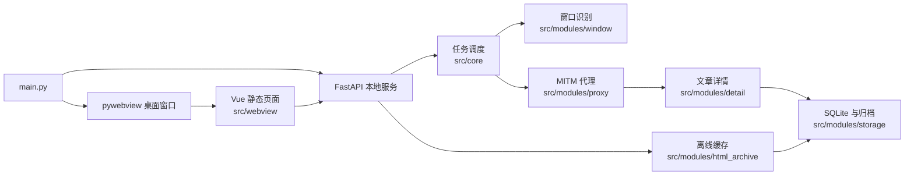

# 架构说明

本文说明 Access WeChat Article 当前代码结构和运行链路，便于贡献者快速定位模块。

## 1. 总体运行方式

项目是一个 Windows 本地桌面程序：

1. `main.py` 启动 pywebview 桌面窗口。
2. 桌面窗口加载 `src/webview/` 中的静态页面。
3. 程序同时启动 FastAPI 本地服务，默认地址为 `http://127.0.0.1:8766/`。
4. 前端通过 `/api/...` 调用后端能力。
5. 后端调度代理、窗口识别、文章采集、SQLite 存储、本地归档和 Playwright 离线缓存。

## 2. 主要目录

- `main.py`：桌面程序入口，启动 FastAPI 服务和 pywebview 窗口。
- `dev_server.py`：开发阶段 FastAPI 后端入口，不打开 pywebview 窗口。
- `src/app/fastapi_app/`：FastAPI 应用、路由和本地服务生命周期。
- `src/app/pywebview_app/`：pywebview 桌面壳能力，包括窗口、系统目录、证书和本地操作。
- `src/core/`：任务状态、任务调度、日志、进程管理和运行配置。
- `src/config/`：读取和合并 `data/custom.yaml` 用户配置。
- `src/modules/proxy/`：MITM 控制、系统代理、证书、HTTPS 探测和捕获等待。
- `src/modules/window/`：微信主页窗口查找、候选文章游标、窗口聚焦保护和详情窗口关闭。
- `src/modules/detail/`：文章详情、账号身份和评论信息解析。
- `src/modules/storage/`：SQLite、建表脚本、本地归档、删除服务和 Excel 导出。
- `src/modules/html_archive/`：Playwright 单篇文章离线缓存、滚动策略、资源保存和 HTML 重写。
- `src/modules/system/`：环境检查、端口检查、进程检查和临时文件清理。
- `src/services/`：面向上层调用的业务服务封装。
- `src/workers/`：后台采集、MITM、文章窗口、评论和离线缓存 worker。
- `src/webview/`：Vue 构建后的静态页面，用于桌面程序和本地 FastAPI 静态访问。
- `tests/`：自动化测试和手动探针脚本。
- `doc/`：安装、功能和架构文档。

## 3. 数据流

### 主服务采集

1. 用户在微信 PC 客户端打开公众号、服务号或订阅号主页。
2. 前端调用后端任务启动 API。
3. `src/core/task_manager.py` 创建任务并调用文章采集 worker。
4. `src/modules/window/` 找到真实主页窗口，读取当前可见文章候选。
5. 程序点击文章，等待 `src/modules/proxy/` 捕获微信内置浏览器请求。
6. `src/modules/detail/` 解析文章详情、评论和统计字段。
7. `src/modules/storage/` 写入 SQLite，并把详情文件写入 `storages/`。

### 离线缓存

1. 后端从 SQLite 读取已保存的文章短链接。
2. `src/modules/html_archive/` 使用 Playwright 打开短链接。
3. 滚动策略尽量触发懒加载资源。
4. 只保存正文实际引用的资源。
5. 生成 `index.html` 和 `assets/`，写入对应文章归档目录。

### Excel 导出

1. 前端选择一个或多个公众号。
2. 后端按公众号查询 SQLite 文章记录。
3. 导出服务尝试读取每篇文章的 `article_detail.json`。
4. 缺少详情文件时仍导出 SQLite 中已有字段，并在“记录状态”写明原因。
5. 每个公众号生成一个 Excel 文件。

## 4. 运行时目录

- `data/custom.yaml`：用户可修改配置，当前作为示例配置纳入版本管理。
- `data/awa_public.sqlite3`：本地 SQLite 数据库，不纳入版本管理。
- `data/logs/`：运行日志，不纳入版本管理。
- `data/tmp/`：临时文件，不纳入版本管理。
- `.mitmproxy/`：mitmproxy 证书和配置，不纳入版本管理。
- `.playwright-browsers/`：项目内 Playwright 浏览器，不纳入版本管理。
- `storages/`：文章本地归档，不纳入版本管理。

## 5. 前端源码与构建产物

当前仓库默认保留 `src/webview/` 构建产物，便于用户直接运行桌面程序。`vue-project/` 是本地前端开发工程，默认不纳入版本管理。

如果未来决定开放前端源码，需要同步更新：

- `.gitignore`
- README
- `doc/install_zh.md`
- CI 中的前端构建步骤

## 6. 测试边界

适合 CI 的测试应避免依赖真实微信窗口、真实 MITM 代理、系统代理修改和浏览器可视化操作。

建议默认 CI 只运行：

- 纯 Python 语法检查。
- SQLite、归档路径、Excel 导出、缓存任务组装等单元测试。
- 使用 fake object 或 mock 的窗口识别逻辑测试。

需要人工环境的测试应放在 `tests/tools/` 或独立测试说明中，并明确依赖 Windows、微信 PC 客户端、本地证书或真实网络。
