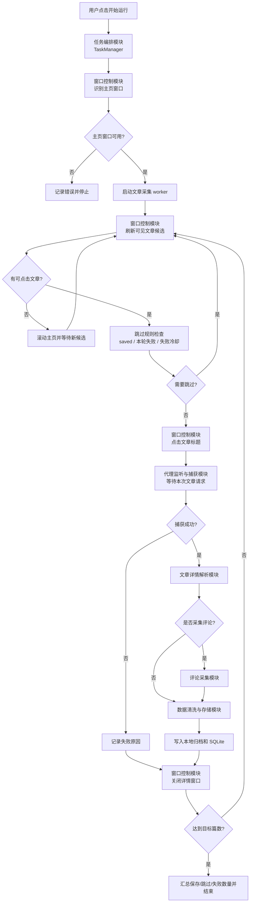
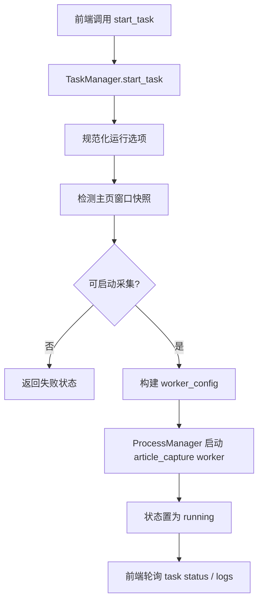
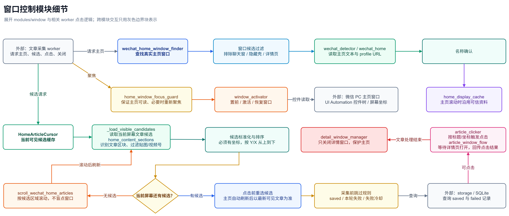
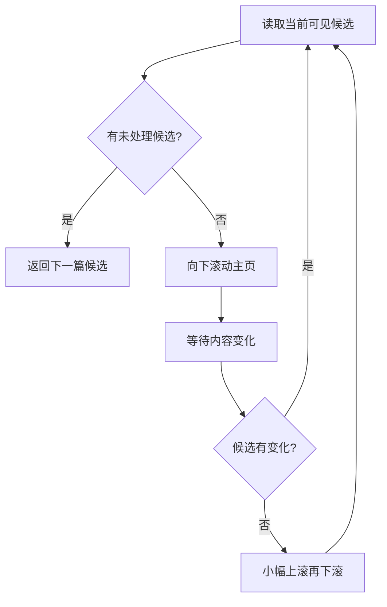
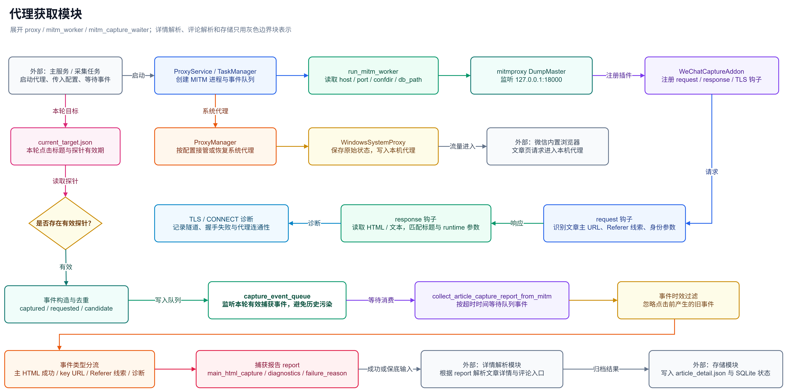
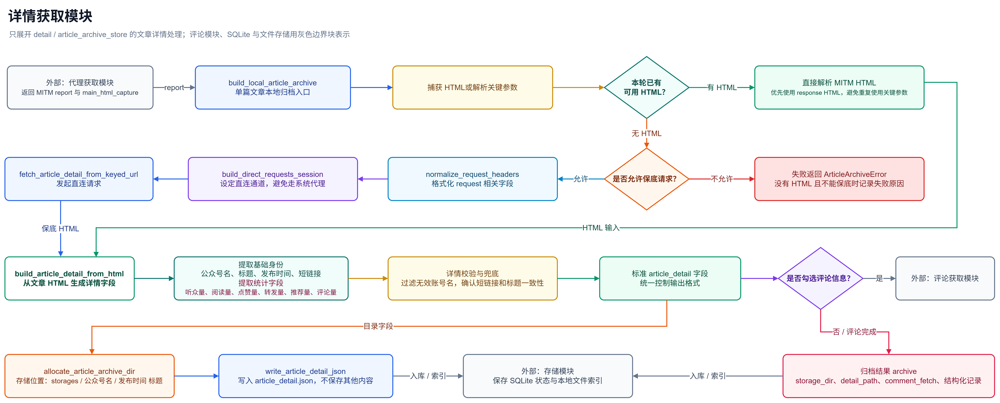
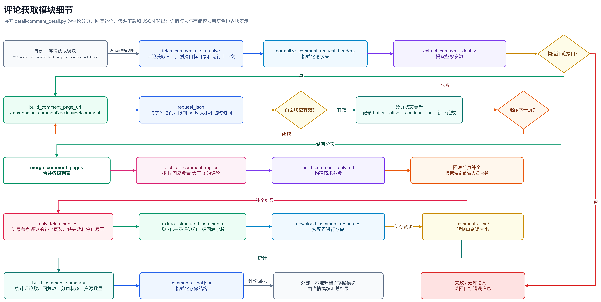
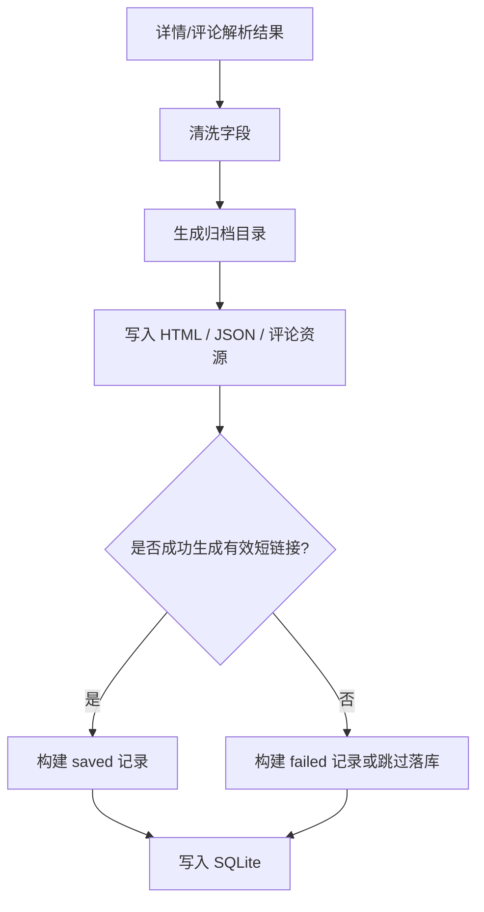
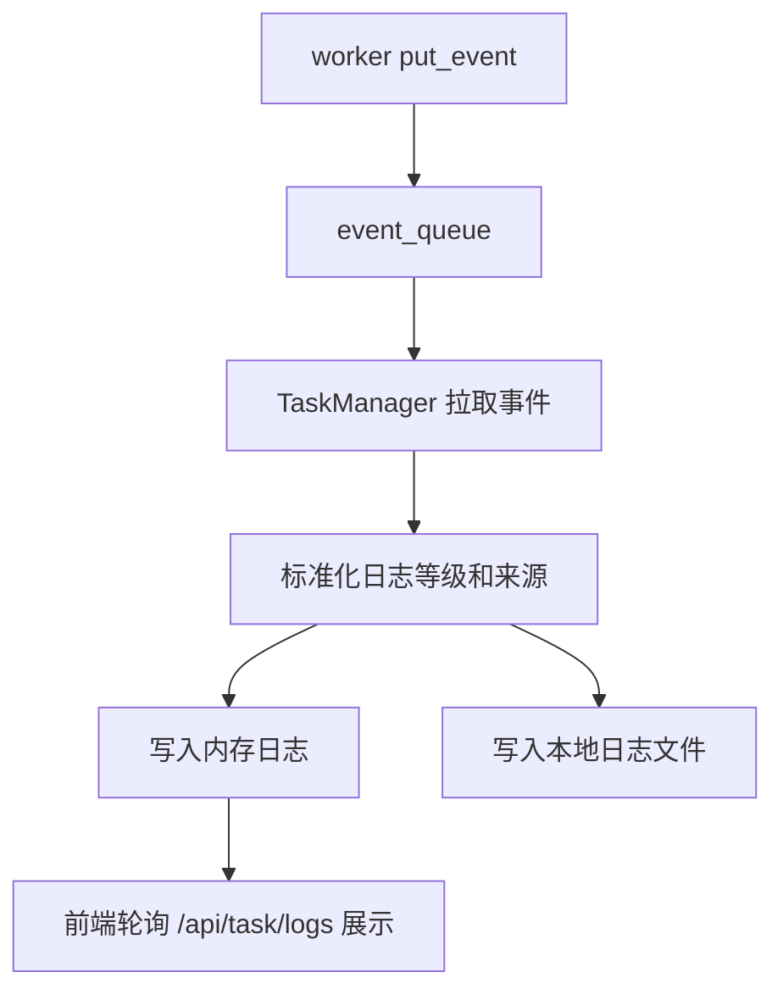

# 快速入手

本文面向第一次阅读、使用或准备二次开发 Access WeChat Article 的使用者。

它的目标不是替代完整安装文档和功能文档，而是帮助你快速建立程序主流程的架构认知：

- 程序启动后如何运行；
- 主流程由哪些大模块组成；
- 每个大模块内部又负责哪些子能力。

如需查看完整安装步骤和页面功能说明，请先阅读：

- [安装说明](./install.md)
- [功能说明](./features.md)

## 1. 快速启动

项目使用 `uv` 管理 Python 环境。进入项目根目录后执行：

```bash
uv sync
```

首次使用 Playwright 离线缓存功能前，需要把 Chromium 浏览器安装到项目目录：

```powershell
$env:PLAYWRIGHT_BROWSERS_PATH=".playwright-browsers"
uv run playwright install chromium
```

启动桌面程序：

```bash
uv run python main.py
```

程序启动后，可以通过桌面窗口使用，也可以在浏览器访问本地网页端：

```text
http://127.0.0.1:8766/
```

开发调试后端接口时可单独启动：

```bash
uv run python dev_server.py
```

> 注意：`dev_server.py` 只启动本地 FastAPI 服务，不打开 pywebview 桌面窗口。正常使用优先运行 `main.py`。

## 2. 主流程总览

主流程指“主服务页面点击开始运行后，程序从当前打开的公众号/服务号主页逐篇采集文章”的流程。

从架构上看，它可以分为七个大模块：

1. **任务编排模块**：接收开始/停止指令，组织配置、进程、日志和 worker 生命周期。
2. **窗口控制模块**：识别主页窗口、识别文章候选、滚动主页、点击文章、关闭详情窗口。
3. **代理监听与捕获模块**：通过本地 MITM 监听微信内置浏览器请求，捕获当前文章的 HTML 和请求信息。
4. **文章详情解析模块**：从文章 HTML 中提取标题、公众号、发布时间、短链接和互动指标。
5. **评论采集模块**：在用户勾选评论信息时，继续获取评论、回复、评论图片和表情信息。
6. **数据清洗与存储模块**：清洗字段、生成本地目录、写入 JSON/HTML 归档和 SQLite 索引。
7. **状态日志与异常保护模块**：贯穿全流程，负责前端状态、运行日志、失败记录、停止和资源收尾。

这些模块不是简单地互相替代，而是围绕“单篇文章采集循环”协同工作：窗口模块打开一篇文章，代理模块捕获这篇文章的请求，详情和评论模块解析数据，存储模块落地结果，然后窗口模块关闭详情页并继续下一篇。

## 3. 主流程程序流程图



## 4. 任务编排模块

任务编排模块是主流程的入口层。它不直接解析文章内容，也不直接操作微信控件，而是负责把前端操作转换成可控的后台任务。

### 4.1 模块职责

它主要负责：

- 接收主服务页面的开始、停止、状态查询和日志查询请求。
- 读取用户配置、采集数量、采集内容选项和跳过规则。
- 启动文章采集 worker。
- 管理 MITM 代理、系统代理、任务状态和进程生命周期。
- 汇总 worker 上报的运行事件，提供给前端日志区域展示。

### 4.2 主要代码位置

- `src/core/task_manager.py`
- `src/core/process_manager.py`
- `src/core/events.py`
- `src/core/file_logger.py`
- `src/workers/article_capture.py`

### 4.3 内部流程图



### 4.4 需要关注的设计点

任务编排模块的重点是“可控”和“可恢复”。例如开始任务时要避免重复启动 worker，停止任务时要确保子进程能结束，任务完成后要裁剪运行期内存日志，避免长时间运行导致日志无限增长。

## 5. 窗口控制模块

窗口控制模块是主流程中和微信 PC 客户端交互最多的部分。它负责回答四个问题：当前应该操作哪个主页窗口、当前屏幕有哪些文章、应该点击哪篇、采集结束后应该关闭哪个详情窗口。

### 5.1 模块职责

它主要负责：

- 找到真实可见的公众号/服务号/订阅号主页窗口。
- 读取主页账号名和主页内容状态。
- 识别当前可见区域中有坐标、可点击的文章标题。
- 跳过贴图、视频号、无坐标节点、非文章区域等干扰项。
- 当前屏幕处理完后滚动主页，加载下一批文章候选。
- 点击目标文章，等待微信内置浏览器文章详情页打开。
- 单篇采集完成后关闭详情窗口，不能误关主页窗口。

### 5.2 主要代码位置

- `src/modules/window/wechat_home_window_finder.py`
- `src/workers/wechat_home.py`
- `src/modules/window/home_article_cursor.py`
- `src/workers/home_article_clicker.py`
- `src/modules/window/home_content_sections.py`
- `src/modules/window/home_window_focus_guard.py`
- `src/modules/window/article_window_flow.py`
- `src/modules/window/detail_window_manager.py`
- `src/modules/window/window_activator.py`

### 5.3 主页窗口识别

主页窗口识别会在 Windows 桌面窗口中筛选微信相关窗口，并优先选择真实可见的公众号/服务号/订阅号主页。它需要排除微信聊天主窗口、隐藏壳窗口、微信内置浏览器详情页和本程序窗口。

账号名不应该从普通标题、简介或状态提示中猜测。当前更可信的方式是读取主页 `DocumentControl` 中的 profile URL，并从 `profile.html?showName=` 解码出账号名。



### 5.4 主页内容和文章候选识别

主页内容识别不是把 UI 树里的所有文字都当成文章标题，而是优先寻找有坐标、在可视区域、具备文章特征的标题节点。这样可以避免程序纠结于 UI 树中不可见或没有坐标的历史节点。

候选会按屏幕坐标从上到下排序，保证主流程从当前可见区域开始逐篇处理。

### 5.5 主页滚动和候选刷新

当当前可见区域没有可继续处理的候选时，程序会向下滚动主页并重新读取候选。如果滚动后长时间没有加载出新内容，会尝试小幅回弹再继续向下滚动，用来触发微信主页的懒加载。



### 5.6 目标点击和详情窗口关闭

点击前会尽量让主页窗口重新获得焦点，然后使用候选文章的真实坐标点击。点击后，程序等待微信内置浏览器文章详情窗口出现。

采集完成后，窗口关闭逻辑只应关闭文章详情窗口，不得通过模糊标题或固定坐标误关公众号/服务号主页。

## 6. 代理监听与捕获模块

代理监听与捕获模块负责拿到“点击文章后产生的真实文章请求”。它不负责选择文章，也不负责解析文章字段，而是负责把微信内置浏览器请求中的目标 HTML 和请求信息交给后续模块。

### 6.1 模块职责

它主要负责：

- 启动和管理本地 MITM 代理。
- 监听微信内置浏览器访问 `mp.weixin.qq.com` 时产生的请求。
- 过滤与当前文章无关的资源请求、诊断请求和其他噪声。
- 等待当前点击文章对应的主 HTML。
- 生成 capture report，提供给文章详情解析和存储模块。
- 对日志和诊断中的敏感参数做脱敏。

### 6.2 主要代码位置

- `src/workers/mitm_worker.py`
- `src/modules/proxy/mitm_controller.py`
- `src/modules/proxy/mitm_capture_waiter.py`
- `src/modules/proxy/proxy_manager.py`
- `src/modules/proxy/system_proxy.py`
- `src/modules/proxy/certificate.py`

### 6.3 捕获流程



### 6.4 关键原则

代理模块只应该等待本次点击产生的请求。为了避免重复请求带 `key` 的 URL，程序不应为了补救捕获失败而主动刷新文章页或反复访问临时链接。

日志中涉及 `key`、`pass_ticket`、`appmsg_token`、Cookie 等字段时，需要脱敏后再展示或保存。

## 7. 文章详情解析模块

文章详情解析模块负责把 MITM 捕获到的 HTML 转换为结构化字段。它是从“网页内容”进入“研究数据”的第一层。

### 7.1 模块职责

它主要负责解析：

- 公众号名。
- 文章标题。
- 发布时间。
- 文章短链接。
- IP 属地。
- 听众量、阅读量、点赞量、转发量、推荐量、评论量等可用指标。
- 文章详情 JSON 所需的基础字段。

### 7.2 主要代码位置

- `src/modules/detail/article_detail.py`
- `src/modules/detail/account_identity.py`
- `src/modules/storage/article_archive_store.py`

### 7.3 解析流程



### 7.4 和其他模块的关系

文章详情模块的输出会继续交给数据清洗与存储模块。如果用户勾选了评论信息，评论采集模块还会使用文章 HTML 中的评论参数继续获取评论数据。

## 8. 评论采集模块

评论采集模块是可选模块，只有主服务页面勾选“评论信息”时才会进入。它依赖文章详情 HTML 中的评论相关参数，不独立选择文章。

### 8.1 模块职责

它主要负责：

- 从文章 HTML 中提取评论接口所需参数。
- 构造评论接口请求。
- 分页读取一级评论。
- 读取评论回复。
- 保存评论正文、昵称、时间、点赞数、回复关系等结构化字段。
- 保存评论中的图片和表情资源。
- 头像默认保存链接到 JSON，不默认下载头像。

### 8.2 主要代码位置

- `src/modules/detail/comment_detail.py`
- `src/workers/comment_worker.py`
- `tests/test_comment_fetcher.py`

### 8.3 评论采集流程



### 8.4 需要注意的点

评论数据依赖微信接口返回结果，因此比文章详情更容易受到网络、接口状态、参数有效期和页面内容差异影响。评论采集失败时，不应该影响已经成功解析的文章详情字段入库判断，需要把失败原因记录清楚。

## 9. 数据清洗与存储模块

数据清洗与存储模块负责把前面模块得到的结果落地。它的核心原则是：大内容进本地归档目录，轻量索引进 SQLite。

### 9.1 模块职责

它主要负责：

- 清洗公众号名、文章标题和发布时间。
- 生成 Windows 可用的本地归档路径。
- 写入 `article_detail.json`、`original_main.html`、`comments_final.json` 等文件。
- 处理评论图片、表情等资源目录。
- 构建 SQLite 文章记录。
- 区分 `saved` 和 `failed` 状态。
- 处理同名目录、重复短链接和失败记录更新。

### 9.2 主要代码位置

- `src/modules/storage/article_archive_store.py`
- `src/modules/storage/path_builder.py`
- `src/modules/storage/sqlite_store.py`
- `src/modules/storage/public_article_store.py`
- `src/modules/storage/awa_public_schema.sql`

### 9.3 本地归档结构

单篇文章默认保存到：

```text
storages/公众号名/文章发布时间 文章标题/
```

常见文件包括：

- `article_detail.json`：文章结构化详情。
- `original_main.html`：MITM 捕获的文章 HTML。
- `comments_final.json`：评论结构化结果，只有采集评论时生成。
- `comments_img/`：评论图片、表情等资源目录。

### 9.4 SQLite 索引结构

SQLite 主要保存两张表：

- `awa_public_accounts`：公众号索引。
- `awa_public_articles`：文章索引。

SQLite 只保存账号、标题、发布时间、短链接、采集类型、采集时间、耗时和状态等轻量字段，不保存正文大内容。

### 9.5 存储流程图



## 10. 状态日志与异常保护模块

状态日志与异常保护模块贯穿所有主流程模块。它不是单独的一步，而是保证任务可观察、可停止、可排查的重要基础设施。

### 10.1 模块职责

它主要负责：

- 接收 worker 上报的运行事件。
- 给前端提供运行状态和日志列表。
- 写入本地日志文件。
- 裁剪内存日志，避免长时间运行导致内存增长。
- 记录成功、失败、跳过、停止等状态。
- 在异常情况下尽量关闭详情窗口、停止进程、恢复代理状态。

### 10.2 主要代码位置

- `src/core/task_manager.py`
- `src/core/events.py`
- `src/core/file_logger.py`
- `src/core/log_levels.py`
- `src/core/process_manager.py`
- `src/core/progress_logger.py`

### 10.3 日志链路流程图



### 10.4 异常保护重点

需要重点关注这些异常场景：

- 主页窗口不可读或被其他窗口遮挡。
- 点击文章失败。
- MITM 没有捕获到目标 HTML。
- 评论接口请求失败。
- SQLite 入库失败。
- worker 进程无法正常停止。
- MITM 或系统代理异常退出后影响其他应用联网。

## 11. 主流程之外的辅助模块

除了主流程，项目还有一些围绕数据维护和使用体验的辅助模块。这些模块不一定参与“点击主页文章并采集”的主循环，但会复用 SQLite、本地归档和前端 API。

### 11.1 数据档案模块

数据档案页用于查看公众号列表、文章记录、缓存状态、删除记录、打开归档目录和批量导出 Excel。

相关代码：

- `src/modules/storage/archive_delete_service.py`
- `src/modules/storage/archive_excel_export_service.py`
- `src/modules/storage/archive_storage_info.py`
- `vue-project/src/pages/DataFilesPage.vue`

### 11.2 Playwright 离线缓存模块

离线缓存模块用于根据 SQLite 中已保存的短链接，使用 Playwright 打开文章并保存离线 `index.html` 和正文实际引用资源。它和主流程采集不同，不依赖 MITM 的临时 key 参数。

相关代码：

- `src/modules/html_archive/`
- `src/workers/article_html_archive_worker.py`

### 11.3 系统配置和环境维护模块

系统配置页负责运行目录、日志等级、代理开关、证书安装、缓存清理等能力。

相关代码：

- `src/app/pywebview_app/`
- `src/config/`
- `src/modules/proxy/`
- `src/modules/system/`

## 12. 开发定位建议

如果你要修改主流程，建议按问题类型优先定位：

- 启动无响应、停止不了：先看 `src/core/task_manager.py` 和 `src/core/process_manager.py`。
- 主页识别错误：先看 `src/modules/window/wechat_home_window_finder.py` 和 `src/workers/wechat_home.py`。
- 点击了错误文章：先看 `src/modules/window/home_article_cursor.py` 和 `src/workers/home_article_clicker.py`。
- 误关主页窗口：先看 `src/modules/window/detail_window_manager.py` 和 `src/modules/window/article_window_flow.py`。
- 捕获不到文章请求：先看 `src/modules/proxy/mitm_capture_waiter.py` 和 `src/workers/mitm_worker.py`。
- 文章详情字段缺失：先看 `src/modules/detail/article_detail.py`。
- 评论慢或评论缺失：先看 `src/modules/detail/comment_detail.py`。
- SQLite 记录异常：先看 `src/modules/storage/sqlite_store.py` 和 `src/modules/storage/article_archive_store.py`。
- 数据档案页异常：先看 `src/modules/storage/` 下的归档服务和 `vue-project/src/pages/DataFilesPage.vue`。

## 13. 推荐验证命令

窗口识别和主流程候选相关：

```bash
uv run python -m unittest tests.test_wechat_window_activation tests.test_home_article_cursor
```

归档、缓存、导出、清理相关：

```bash
uv run python -m unittest tests.test_archive_cache_service tests.test_archive_delete_service tests.test_archive_excel_export_service tests.test_runtime_cleanup tests.test_sqlite_store
```

入口文件语法检查：

```bash
uv run python -m py_compile main.py dev_server.py
```

如果涉及真实微信窗口、系统代理、MITM 或浏览器测试，测试结束后需要确认：

- `127.0.0.1:8766` 没有遗留自己启动的服务。
- `127.0.0.1:18000` / `localhost:18000` 没有遗留 MITM 子进程。
- 系统代理已恢复到测试前状态。
- 没有把测试产物写到项目根目录、`D:\tmp` 或未受控目录。

